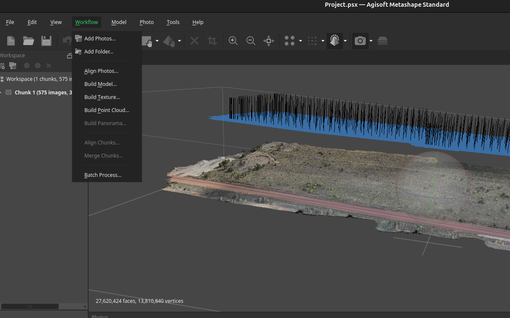
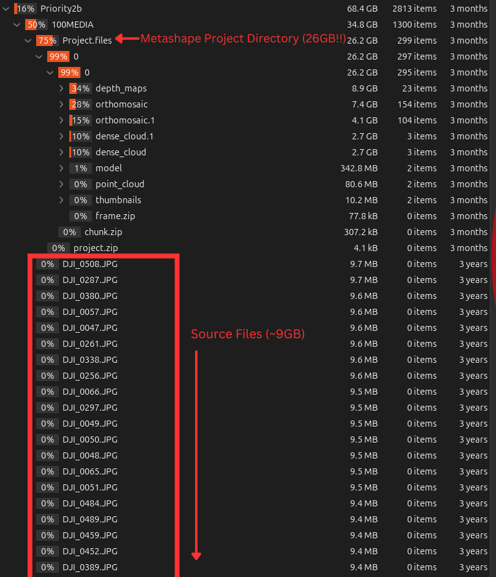

# drone-imagery-notes
A colleection of learnings while exploring processing and storage of drone imagery during my masters research project

## Agisoft Metashape

### Standard edition vs Professional Edition
The killer feature in professional edition is the ability to "Build Panorama" (also called "Build Orthomosaic in some versions)

### Making the best use of the free 30 day trials

For each machine you may obtain:
- 1 Standard edition 30 day trial
- 1 Professional edition 30 day trial

For a total of 60 days of free trial.

As the metashape project files are re-usable between editions, I strongly recommend that you perform as much processing as possible while on the standard edition free trial before starting a new professional edition trial to complete your "Build Panorama" steps.

Image processing steps you should perform BEFORE starting your 30 day professional trial:
- Import all images into a (number of) metashape project(s)
- Perform all image processing possible in the Standard Edition
    - Align Photos
    - Build Model
    - Build Texture
    - BUild Point Cloud

These preliminary processing steps are necessary before building the panorama regardless, so best to get it done on the limited version of the software first so you can make maximum usage of the professional edition to build panoramas while you have it.

See [Student Licenses](#student-licences) for how to attain a perpetual licence in the case that you require more usage past the 60 days of free trials.

### Project Size
Realistically you probably can't fit all of your source data into a single project and have it build successfully without crashing. I found the sweetspot to be around 1000 images on a modern desktop (i5-14600K, RTX4060Ti 16GB, 32GB RAM, comparable results on a silicon macbook with M1 Pro chip but with slower processing due to lacking GPU acceleration).

Metashape crashes seem almost exclusively to be due to running out of RAM, so in theory that number may scale proportionally with how much RAM your system has (eg ~500 images for a 16GB system, 2000 images for a 64GB system).

### Storage
Agisoft Metashape projects will eat your harddrive for breakfast, come prepared with LOTS of free storage space. This is because they effectively make multiple copies of every imported image inside the metashape project file as it builds the orthomosaic. See below for how ~9GB of JPG images produces a 25GB+ metashape project file.

 

### Student Licenses
Agisoft offers cheaper pricing for education licences if you want to run this software on your own PC (as of writing US$59 for the standard edition, which is what I used):

https://www.agisoft.com/buy/online-store/educational-license/

Note that the license acquiring process is moderately sketchy (international bank transfer with a reference number) but I risked my US$59 so you don't have to and it worked for me!
